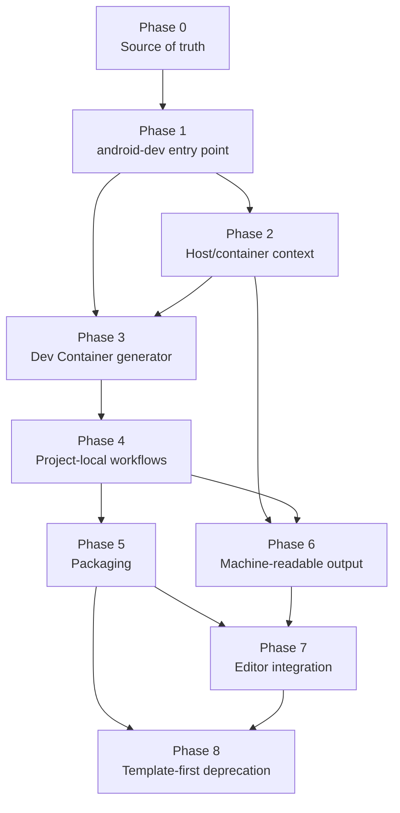

# Plans

This folder contains the execution plans for cutting over from the current
cloneable Android Dev Container template to the installable `android-dev` CLI.

The phase plans are intentionally separate from the product direction docs. The
direction explains what the product should become; these plans explain how to
get there without breaking the working codebase.

## Phase Map

## Dependency Summary

| Phase | Depends on | Why |
| --- | --- | --- |
| [Phase 0](phase-0-source-of-truth.md) | None | Establishes the shared direction before code changes |
| [Phase 1](phase-1-cli-entrypoint.md) | Phase 0 | The public command must be named before behavior moves under it |
| [Phase 2](phase-2-host-container-context.md) | Phase 1 | Host/container checks need the stable `android-dev` command |
| [Phase 3](phase-3-devcontainer-generator.md) | Phases 1, 2 | Generation runs on the host and must share the public command |
| [Phase 4](phase-4-project-local-workflows.md) | Phase 3 | Project-local workflows depend on generated project-local config |
| [Phase 5](phase-5-packaging.md) | Phase 4 | Packaging must include useful project-local behavior |
| [Phase 6](phase-6-machine-readable-output.md) | Phases 2, 4 | JSON output needs stable diagnostics and project selection |
| [Phase 7](phase-7-editor-integration.md) | Phases 5, 6 | Editor integration needs an installable CLI and stable JSON |
| [Phase 8](phase-8-deprecate-template-first.md) | Phases 5, 7 | Deprecation happens only after installed usage and optional editor workflows are proven |

## Global Rules

* Keep the repository-local script working until installed CLI usage is proven.
* Prefer additive changes before replacement changes.
* Every phase must have validation and rollback.
* Never overwrite developer project files without preview or confirmation.
* Keep CLI behavior as the source of truth; editor integrations call the CLI.
* Keep docs aligned with actual behavior at each phase.

## Global Test Gates

| Gate | Applies when |
| --- | --- |
| `bash -n .devcontainer/scripts/*.sh .devcontainer/scripts/lib/*.sh` | Every phase |
| `bash .devcontainer/scripts/android-dev.sh --help` | Until the compatibility wrapper is removed |
| `android-dev --help` | Phase 1 onward |
| Template smoke test | Any project template or packaging change |
| `android-dev devcontainer init --dry-run` | Phase 3 onward |
| Host `android-dev doctor` | Phase 2 onward |
| Container `android-dev doctor` | Phase 2 onward |
| JSON validation | Phase 6 onward |
| Package install smoke test | Phase 5 onward |
