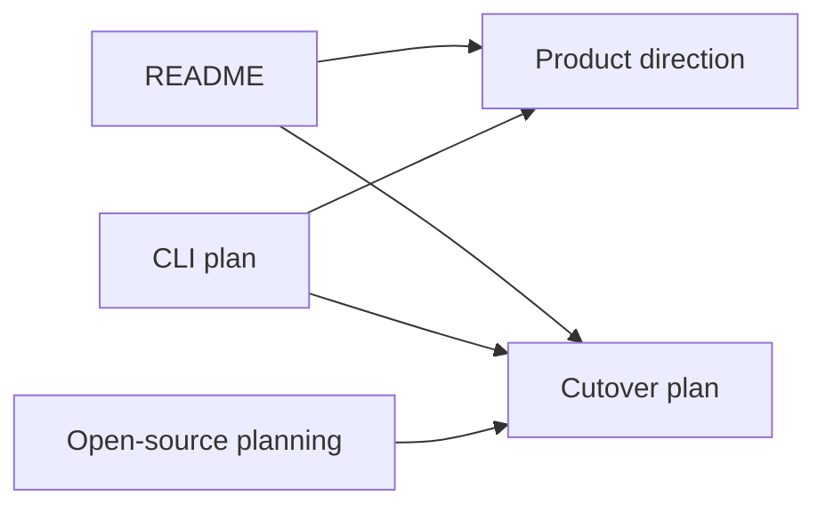

# Phase 0: Source of Truth

## Goal

Align the repository around the installable `android-dev` CLI direction before
moving runtime behavior.

## Depends On

None.

## Why This Comes First

Without a clear source of truth, contributors may keep improving the clone-first
template while other work shifts toward the installed CLI. This phase prevents
parallel, conflicting product assumptions.

## Current State



## Work

* Keep `docs/product-direction.md` as the product source of truth.
* Keep `docs/cutover-plan.md` as the migration overview.
* Keep `docs/plans/` as the detailed execution plan folder.
* Keep `docs/open-source-planning.md` as the staging area for issues and
  discussions.
* Open product direction, VS Code extension, and Dev Container generator safety
  discussions.
* Open roadmap issues for Phases 1 through 6.

## Acceptance Criteria

* README links to product direction, cutover plan, and phase plans.
* The CLI plan references the cutover and phase plan folder.
* Open-source planning includes discussion and issue prompts.
* No runtime behavior changes are required.

## Validation

```bash
bash -n .devcontainer/scripts/*.sh .devcontainer/scripts/lib/*.sh
bash .devcontainer/scripts/android-dev.sh --help
```

## Rollback

Revert the documentation changes only. This phase does not change runtime
behavior.
