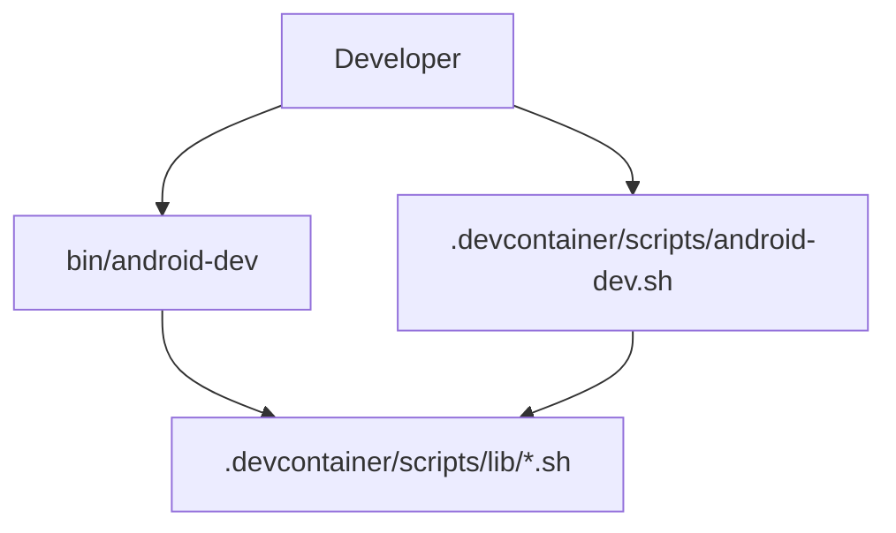

# Phase 1: `android-dev` Entry Point

## Goal

Introduce the target public command while preserving the current
repository-local command.

## Depends On

* [Phase 0](phase-0-source-of-truth.md)

## Why This Dependency Exists

The repository must agree that `android-dev` is the public product interface
before commands, docs, CI, and package layout begin moving around it.

## Target Shape



## Work

* Add a top-level executable such as `bin/android-dev`.
* Make `bin/android-dev` locate implementation files deterministically.
* Keep `.devcontainer/scripts/android-dev.sh` as a compatibility wrapper.
* Update help text so `android-dev <command>` is the public shape.
* Add CI coverage for both command paths.
* Keep all existing commands available.

## Implementation Notes

The first version can still source the existing Bash modules. This phase is
about the public command boundary, not a language rewrite.

## Acceptance Criteria

* `bin/android-dev --help` works from the repository checkout.
* `bin/android-dev templates` works.
* `bin/android-dev logs` works.
* Repository-local `bash .devcontainer/scripts/android-dev.sh --help` still
  works.
* CI validates both entry points.

## Validation

```bash
bash -n .devcontainer/scripts/*.sh .devcontainer/scripts/lib/*.sh
bash .devcontainer/scripts/android-dev.sh --help
bin/android-dev --help
bin/android-dev templates
```

## Rollback

Remove `bin/android-dev` and its CI checks. The compatibility script remains the
working entry point.
