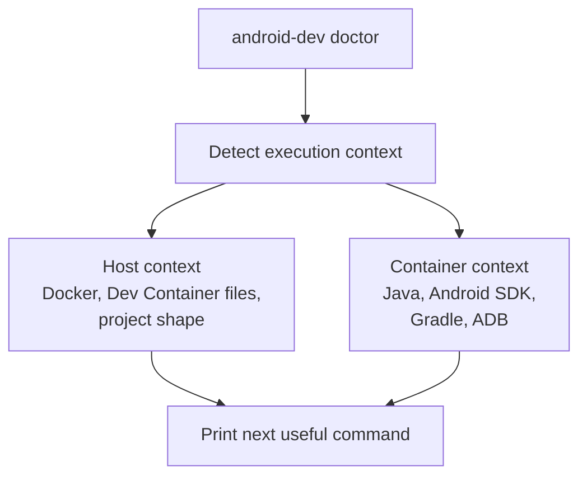

# Phase 2: Host and Container Context

## Goal

Make `android-dev` useful both before and after the Dev Container exists.

## Depends On

* [Phase 1](phase-1-cli-entrypoint.md)

## Why This Dependency Exists

Host and container behavior should be attached to the stable public command.
Otherwise the project would need to redesign context detection again when the
entry point changes.

## Context Model



## Work

* Add deterministic context detection helpers.
* Treat host context as a shell outside the Android Dev Container.
* Treat container context as a shell with Android SDK environment or Dev
  Container markers.
* Split `doctor` into host and container checks.
* Ensure host `doctor` does not require Android SDK or ADB.
* Log context information for major commands.

## Acceptance Criteria

* `android-dev doctor` on the host checks Docker/project setup and gives next
  steps.
* `android-dev doctor` in the container keeps Java, SDK, ADB, package, and
  device checks.
* Missing ADB on the host is not a fatal setup failure.
* Structured `ANDROID-*` errors remain.
* Logs identify the detected context.

## Validation

```bash
android-dev doctor
bash .devcontainer/scripts/android-dev.sh doctor
```

Host validation should run outside the Dev Container. Container validation
should run inside the Dev Container.

## Rollback

Route `doctor` back to the existing container-only behavior and keep context
helpers unused until they are corrected.
