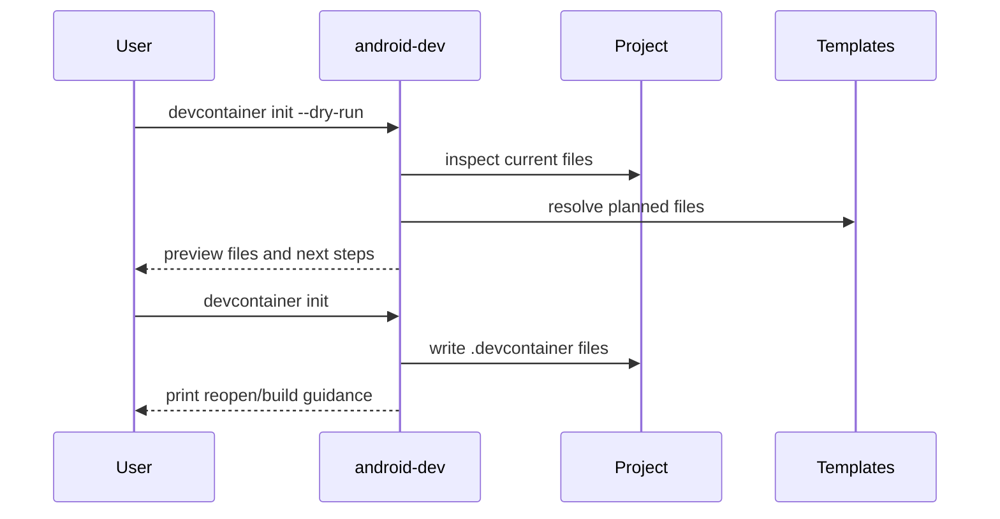

# Phase 3: Dev Container Generator

## Goal

Replace manual copying and `export-devcontainer` with
`android-dev devcontainer init`.

## Depends On

* [Phase 1](phase-1-cli-entrypoint.md)
* [Phase 2](phase-2-host-container-context.md)

## Why These Dependencies Exist

The generator is a host-side workflow, so it needs context-aware `doctor`
behavior. It also needs the stable `android-dev` command because generated files
and next-step messages should not point users back to repository-local paths.

## Generation Flow



## Work

* Add `android-dev devcontainer init`.
* Add `--dry-run` or equivalent preview.
* Move Dev Container content into reusable templates or generator functions.
* Generate `.devcontainer/devcontainer.json`, `Dockerfile.dev`, SDK package
  manifests, and required helper/bootstrap files.
* Refuse to overwrite existing `.devcontainer/` by default.
* Print next steps for VS Code, Cursor, JetBrains, and terminal-only users.
* Mark `export-devcontainer` as a transition command.

## Acceptance Criteria

* Dry run lists every file that would be written.
* Empty project setup writes a complete `.devcontainer/`.
* Existing Gradle Android project setup writes `.devcontainer/` without changing
  Gradle files.
* Existing `.devcontainer/` causes a clear stop by default.
* Generated Dev Container can build in CI or smoke tests.

## Validation

```bash
android-dev devcontainer init --dry-run
android-dev devcontainer init
android-dev doctor
```

Also validate in a temporary existing Android Gradle project.

## Rollback

Disable `devcontainer init` and keep `export-devcontainer` as the supported
transition workflow.
