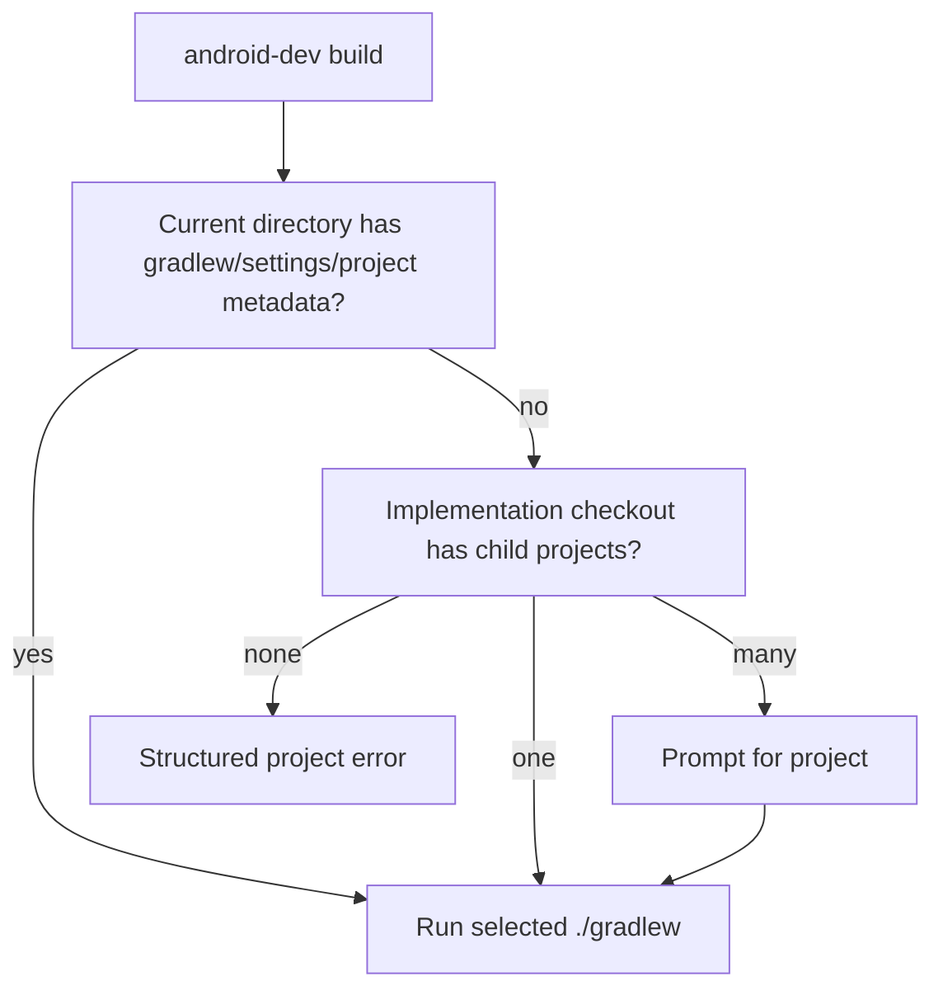

# Phase 4: Project-Local Workflows

## Goal

Shift command execution from workstation-root child project detection to normal
project-root operation.

## Depends On

* [Phase 3](phase-3-devcontainer-generator.md)

## Why This Dependency Exists

Project-local workflow becomes the primary model only after projects can receive
their own generated `.devcontainer/` files.

## Project Selection Model



## Work

* Prefer the current directory when it contains `gradlew`, `settings.gradle*`,
  or `.android-dev/project.json`.
* Keep child project selection for this repository as compatibility behavior.
* Write logs under the project being acted on.
* Keep `run-debug` detection order deterministic:
  1. explicit argument
  2. `.android-dev/project.json`
  3. Gradle files
  4. validated interactive choice only if needed
* Update next-step messages to `android-dev` after Phase 1 is stable.

## Acceptance Criteria

* `android-dev build` runs local `./gradlew` in a normal Android project.
* Existing child-project selection still works in this repository.
* Multiple projects prompt instead of guessing.
* Logs are written under the selected project root.
* Template smoke builds still pass.

## Validation

```bash
android-dev build
android-dev test
android-dev lint
android-dev tasks
```

Run once in a normal project root and once from this implementation checkout.

## Rollback

Keep the new helpers but route project selection back through the current
`select_project_root` behavior.
