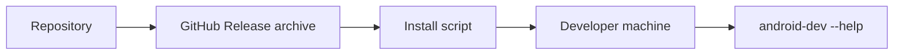

# Phase 5: Packaging

## Goal

Let developers install `android-dev` without manually cloning this repository.

## Depends On

* [Phase 4](phase-4-project-local-workflows.md)

## Why This Dependency Exists

The package should include a useful product, not only a renamed copy of the
current template script. Project-local workflows make the installed CLI worth
testing with early adopters.

## Packaging Flow



## Work

* Choose the first install channel.
* Recommended first path: GitHub Release archive plus install script.
* Add `android-dev version`.
* Package only required runtime files.
* Document install, update, and uninstall.
* Add release smoke tests.
* Consider npm or Homebrew after the first archive/install-script path works.

## Acceptance Criteria

* A developer can install `android-dev` without cloning the repository.
* `android-dev --help` works after installation.
* `android-dev devcontainer init --dry-run` works in a temporary directory.
* Release artifact is versioned.
* Package contents are minimal and documented.

## Validation

```bash
android-dev --help
android-dev version
android-dev devcontainer init --dry-run
```

Run validation from an installed artifact in a clean temporary environment.

## Rollback

Mark the release as pre-release or remove the install instructions. Keep
repository-local development unchanged.
