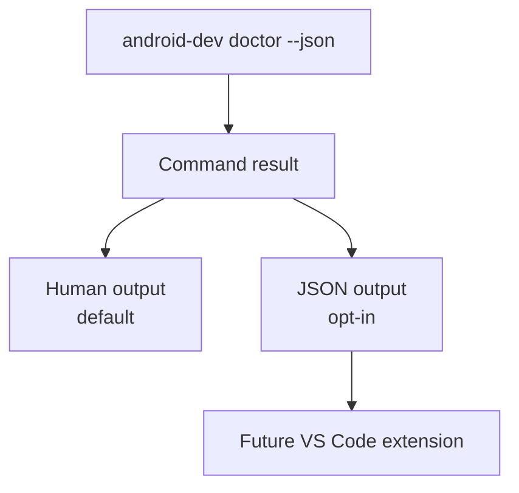

# Phase 6: Machine-Readable Output

## Goal

Add stable JSON output for automation and future editor integrations.

## Depends On

* [Phase 2](phase-2-host-container-context.md)
* [Phase 4](phase-4-project-local-workflows.md)

## Why These Dependencies Exist

JSON output should describe stable behavior. Context detection and project
selection must be predictable before another tool depends on their output.

## Output Model



## Work

* Add `--json` to selected commands:
  * `doctor`
  * `devices`
  * `templates`
  * `logs latest`
* Add machine-readable error fields:
  * `code`
  * `area`
  * `problem`
  * `why`
  * `nextStep`
  * `log`
* Keep human-readable output as the default.
* Document JSON contracts.
* Validate JSON in CI.

## Acceptance Criteria

* `android-dev doctor --json` emits valid JSON.
* `android-dev devices --json` emits valid JSON.
* `android-dev templates --json` emits valid JSON.
* Human output remains the default.
* Error JSON includes stable fields.

## Validation

```bash
android-dev doctor --json
android-dev devices --json
android-dev templates --json
android-dev logs latest --json
```

Each command should be parsed with a JSON parser in CI.

## Rollback

Hide `--json` from docs and leave human-readable output unchanged.
