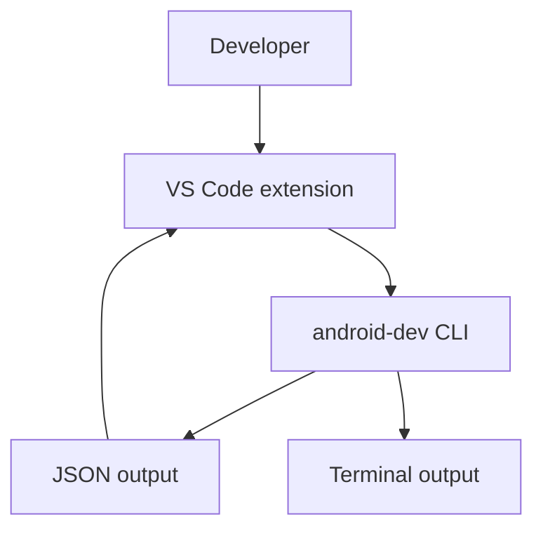

# Phase 7: Editor Integration

## Goal

Build a VS Code or Cursor extension that improves discoverability while keeping
the CLI as the source of truth.

## Depends On

* [Phase 5](phase-5-packaging.md)
* [Phase 6](phase-6-machine-readable-output.md)

## Why These Dependencies Exist

An editor extension needs a discoverable/installable CLI and stable
machine-readable output. Without those, the extension would duplicate logic or
depend on fragile terminal parsing.

## Integration Model

## Work

* Decide whether the extension requires an installed CLI or can guide
  installation.
* Start with command palette actions:
  * Doctor
  * Build
  * Run debug
  * View latest log
  * Add Dev Container
* Use CLI JSON where available.
* Show raw CLI output where JSON is not needed.
* Avoid duplicating SDK, Gradle, ADB, or Dev Container logic.

## Acceptance Criteria

* Extension can find or guide installation of `android-dev`.
* Extension commands call the CLI.
* Extension uses JSON output for structured views.
* CLI remains fully usable without the extension.
* Extension scope is documented as optional.

## Validation

* Run extension commands against an installed `android-dev`.
* Verify missing CLI guidance.
* Verify command output and logs are visible.
* Verify no core Android workflow exists only in the extension.

## Rollback

Keep the extension unpublished or experimental. The CLI remains the supported
product.
