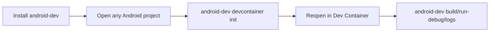

# Phase 8: Deprecate Template-First Usage

## Goal

Finish the cutover by making installed CLI usage the primary public path.

## Depends On

* [Phase 5](phase-5-packaging.md)
* [Phase 7](phase-7-editor-integration.md)

## Why These Dependencies Exist

The clone-first path should only be deprecated after developers have a real
install path and editor users have either a wrapper or clear CLI-only guidance.

## Final Product Shape



## Work

* Move README quick start to installed CLI usage.
* Keep contributor setup for this repository.
* Deprecate or hide `export-devcontainer`.
* Decide final role of `sync-workspace`.
* Update docs to use `android-dev` examples.
* Remove clone-first language from user-facing docs.
* Keep compatibility wrappers where they still help contributors.

## Acceptance Criteria

* New users can follow the README without cloning this repository.
* Contributors still have local development instructions.
* Old commands have documented replacements.
* CI validates installed CLI usage and contributor checkout usage.
* Open-source issue templates assume installed CLI usage.

## Validation

```bash
android-dev --help
android-dev devcontainer init --dry-run
android-dev doctor
```

Also validate contributor commands from the repository checkout.

## Rollback

Restore clone-first README instructions and mark installed CLI docs as
experimental until blockers are resolved.

